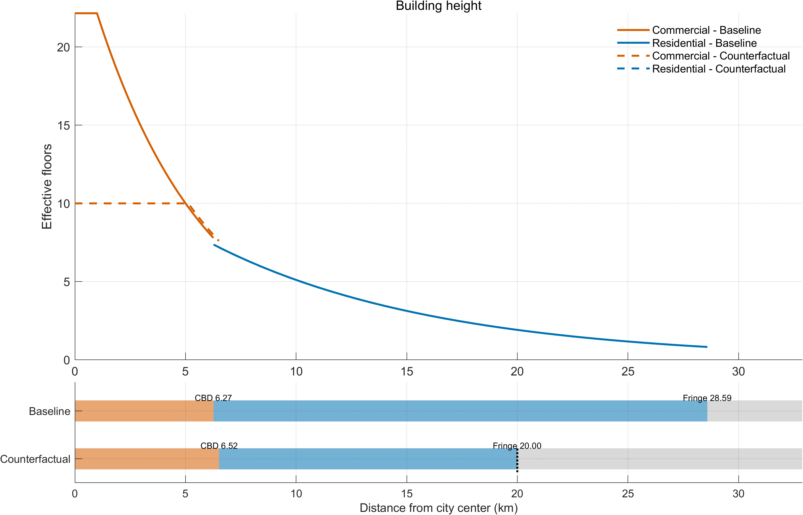
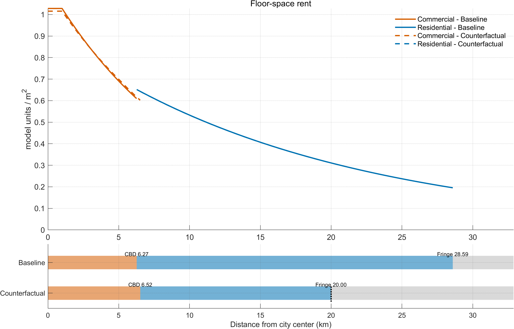
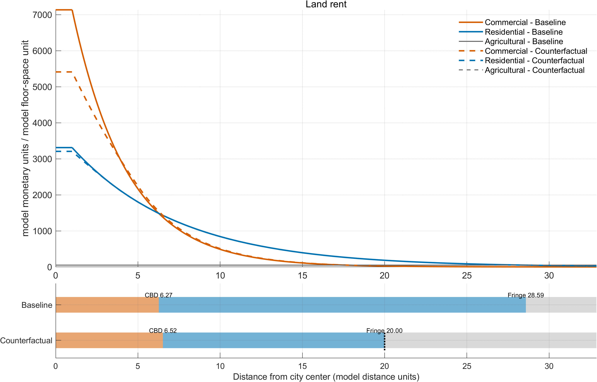
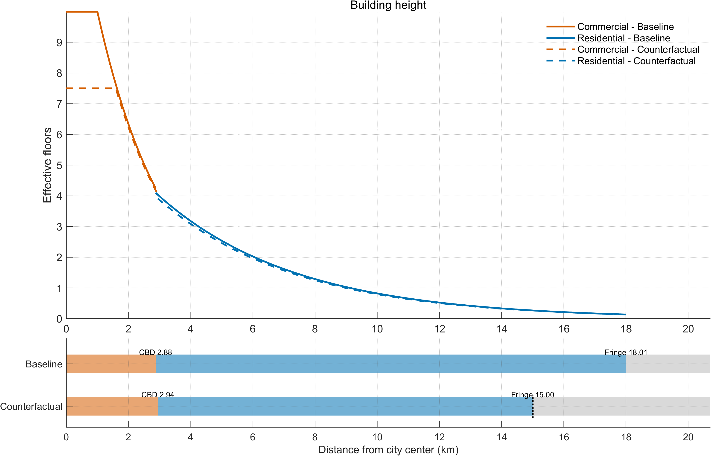
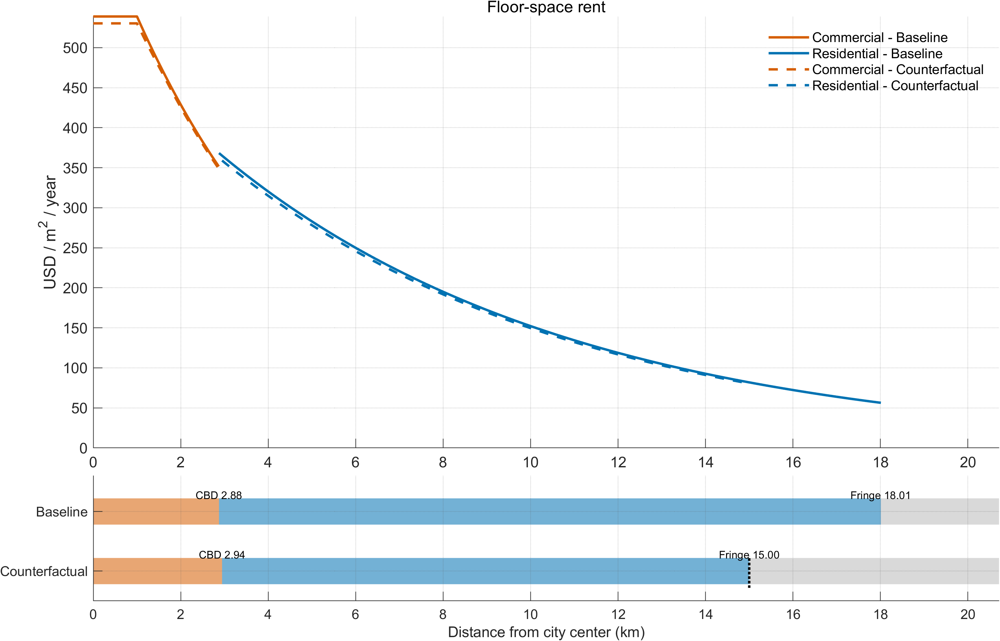
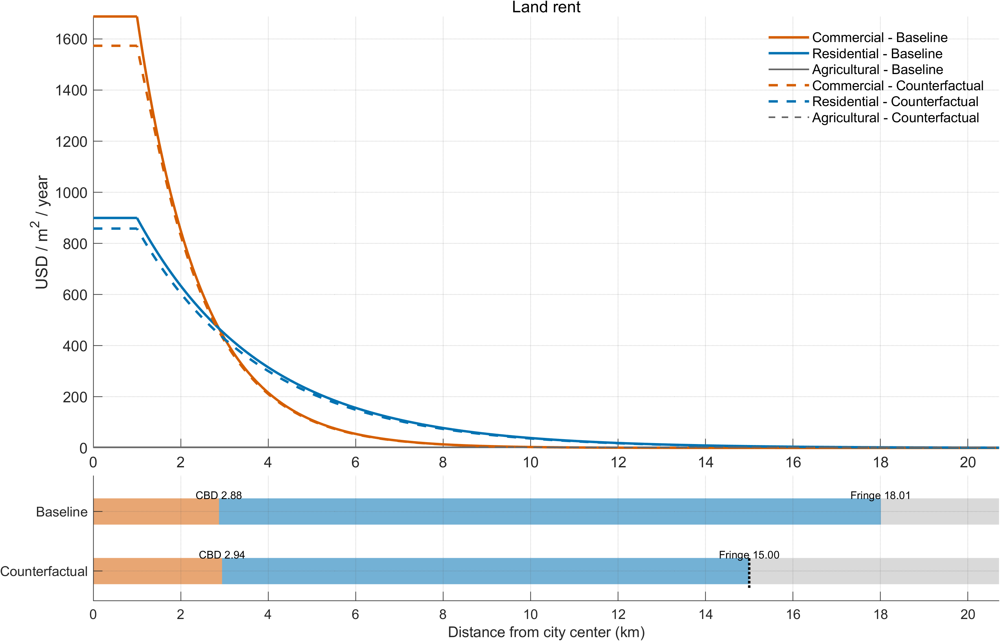

# ABSJ2027 showcase

**How does a city change when it can no longer build as high—or spread as far?**
The ABSJ2027 MATLAB toolkit lets users build a model city, change its fundamentals
or planning constraints, and see the resulting heights, rents, land-use boundaries
and aggregate economic outcomes. It brings the mechanisms of *The Skyscraper
Revolution* into two short, editable master scripts.

The toolkit also extends the set of exercises available to users. They can
**invert the model to additional empirical moments**, including residential rents,
urban area and central CBD floor-area ratio, and evaluate **urban growth
boundaries alongside height limits**. Horizontal growth limits are a toolkit
extension beyond the policy constraints used in the main paper. Both versions
retain the core MATLAB equilibrium equations and make the added calibration and
policy rules explicit.

The examples below are saved illustrative model cities, not estimates for named
real cities. Figures and tables are snapshots of the saved outputs on
9 September 2026, so later experiments will not silently change this showcase.

## From a few inputs to a city and a policy experiment

1. **Choose a baseline.** Keep the paper parameterization, or quantify a city
   against additional observed characteristics.
2. **Specify an experiment.** Set height limits, an urban growth boundary, or
   changes in productivity, amenities or construction costs. Absolute replacements
   and percentage changes are both supported.
3. **Run the master script.** The toolkit constructs the radial city, inverts the
   baseline, solves the counterfactual and exports the figures and tables.

```text
Parameters + city targets → baseline inversion → baseline city
                                                     ↓
                                  optional changes in fundamentals or limits
                                                     ↓
                                    counterfactual equilibrium
                                                     ↓
                             spatial profiles + outcome tables + saved results
```

An empty counterfactual produces the baseline alone. Once the baseline is
quantified, its fitted primitives carry into the counterfactual unless the user
explicitly changes them. The model does not re-fit the baseline targets after a
policy change: population, rents and city size are allowed to respond.

## Two ways to start

| Script | What it is for | What the user supplies |
|---|---|---|
| [MASTER_PAPER.m](../MATLAB/scripts/MASTER_PAPER.m) | Explore the paper's mechanisms with its structural parameterization. | Population, urbanization and an optional height gap; then the policy experiment. |
| [MASTER_EMPIRICAL.m](../MATLAB/scripts/MASTER_EMPIRICAL.m) | Quantify an illustrative city against additional empirical moments. | Population and urbanization, plus optional wage, residential rent **or** floor-space consumption, geographic urban area and central CBD FAR. |

Wage sets the monetary reporting scale. A rent target requires that wage scale;
rent is annual currency per square metre. Floor-space consumption and residential
rent are alternative targets, not two independent inputs to the same calibration.

## Example 1: constrain vertical and horizontal expansion

The paper-parameterization example starts with approximately **3 million urban
residents**, a **50% urbanization rate**, and no height limit or growth boundary.
The counterfactual sets a FAR limit of **10** in both sectors and prevents urban
use beyond **20 model distance units** from the centre:

```matlab
changes = struct();
changes.set.S_bar_C = 10; % Commercial FAR limit.
changes.set.S_bar_R = 10; % Residential FAR limit.
changes.set.x1_max = 20;  % Urban growth boundary, model distance units from the centre.
```

FAR is floor space per unit developable land. In the model it represents effective
height; it is not a literal storey count. The model city is radial, with a central
commercial district and surrounding residential land.

### Where the city builds—and where it stops



Orange denotes commercial use and blue residential use. Solid lines show the
baseline, dashed lines the counterfactual. The strips beneath the profile show
the commercial boundary and urban fringe. The commercial cap binds near the
centre; the fringe moves from **28.59 to 20 model distance units**. Although both sectors face
the same cap, a cap need not bind in both sectors.

### Floor-space rents and land rents





Floor-space rents describe the price of occupying built space. Land-rent curves
show the sectoral bids underlying land-use allocation, including potential bids
outside occupied sectoral land. The land-use strips show which uses are actually
permitted and realized. This matters with a growth boundary: a positive urban
bid outside the boundary does not make development permissible.

### The aggregate consequences

| Outcome | Baseline | With constraints | Change |
|---|---:|---:|---:|
| Urban population (millions) | 2.998 | 2.411 | -19.58% |
| Total geographic urban area (model area units) | 2,567.9 | 1,256.6 | -51.06% |
| Residents per developable model area unit | 2,335 | 3,837 | +64.33% |
| Total floor space (model floor-space units) | 3,623.0 | 2,631.8 | -27.36% |
| Urban fringe (model distance units) | 28.59 | 20.00 | -30.05% |

In this joint experiment, **GDP falls by 20.36%**, average residential rent rises
by **8.35%**, and urban utility falls by **6.01%**. The city loses population but
loses proportionately more land, so average density rises. These are the combined
effects of the two restrictions; they do not isolate the contribution of each.
Run each constraint separately to make that comparison.

The paper example calibrates neither monetary nor physical spatial levels. Monetary outcomes, distances, areas, floor space, densities, and rent denominators are therefore in model units; percentage changes remain directly interpretable.

<details>
<summary>Full exported outcome table: paper-parameterization example</summary>

| Outcome | Unit | Baseline | Counterfactual | Change (%) |
|---|---|---:|---:|---:|
| Urban population | people | 2.99816e+06 | 2.411e+06 | -19.5839 |
| Urbanization rate | fraction | 0.499693 | 0.401834 | -19.5839 |
| GDP | model units | 4.01333e+06 | 3.19608e+06 | -20.3633 |
| Wage bill | model units | 3.41133e+06 | 2.71667e+06 | -20.3633 |
| Wage | model units / worker | 1.13781 | 1.12678 | -0.969182 |
| Total urban area | model area units | 2,567.9 | 1,256.64 | -51.0636 |
| Developable urban area | model area units | 1,283.95 | 628.319 | -51.0636 |
| Population density | people / model area unit | 2,335.1 | 3,837.23 | 64.328 |
| CBD boundary | model distance units | 6.27 | 6.52 | 3.98724 |
| Urban fringe | model distance units | 28.59 | 20 | -30.0455 |
| Commercial floor space | model floor-space units | 759.331 | 634.592 | -16.4275 |
| Residential floor space | model floor-space units | 2,863.69 | 1,997.19 | -30.2582 |
| Total floor space | model floor-space units | 3,623.02 | 2,631.78 | -27.3595 |
| Average residential rent | model monetary units / model floor-space unit | 444.938 | 482.084 | 8.34855 |
| Average commercial rent | model monetary units / model floor-space unit | 811.494 | 771.967 | -4.87091 |
| Commuting disamenity index | index | 1.25984 | 1.21817 | -3.30715 |
| Commuting disamenity: income loss per resident | model units / resident | 0.212398 | 0.183529 | -13.5922 |
| Density amenity index | index | 0.441703 | 0.419184 | -5.09838 |
| Height amenity index | index | 1.02962 | 1.03424 | 0.449058 |
| Urban utility | utility units | 0.104587 | 0.0983025 | -6.00881 |
| Regional expected welfare | utility units | 0.116561 | 0.113353 | -2.75276 |
| Aggregate regional land rent | model units | 1.26885e+06 | 1.22587e+06 | -3.38743 |
| Residential floor space per resident | model floor-space units / resident | 0.000955708 | 0.000827437 | -13.4215 |
| Housing expenditure per resident | model units / resident | 0.386855 | 0.383105 | -0.969182 |
| Height gap (relative to T) | % | 0 | 7.94731 | — |

A dash denotes an undefined percentage change or outcome. The height gap moves
from 0 to 7.95%, an increase of 7.95 percentage points; its percentage change
from zero is undefined.

</details>

Download the full table: [CSV](paper_statistics.csv) · [Excel](paper_statistics.xlsx)
· [LaTeX](paper_statistics.tex).

## Example 2: match a city to more empirical moments

The empirical script starts from the paper's parameters and adjusts selected
primitives to match additional city characteristics. These are economic
calibrations, not relabellings of graph axes.

| Input | Target in this example | How the toolkit uses it |
|---|---:|---|
| Urban population | 3 million | Together with urbanization, identifies regional population and the rural-utility parameter. |
| Urbanization rate | 50% | Urban residents as a share of city-plus-hinterland population. |
| Annual wage | USD 75,000 | Sets a common monetary reporting scale for baseline and counterfactual. |
| Average residential rent | USD 240/m²/year | Adjusts a common multiplier on residential and commercial construction costs. |
| Total urban area | π × 18² ≈ 1,017.88 km² | Adjusts agricultural land rent to target a fringe near 18 km. |
| Central CBD FAR | 10 | Scales both spatial decay parameters together, preserving their ratio. |

“Total urban area” includes non-developable land. With `ell = 0.5`, developable
urban land is half that footprint. Central CBD FAR refers to the city centre,
not the average across the entire commercial district.

The saved baseline achieves rent **USD 240.05/m²/year**, fringe **18.01 km** and
central CBD FAR **9.995**. Residential floor-space consumption is an
outcome—about **125.20 m² per resident**—rather than another fitted target.

For this example, the counterfactual uses **FAR 7.5** in both sectors and an
urban growth boundary at **15 km**:

```matlab
targets.wage = 75000;
targets.residential_rent = 240;
targets.floor_space_per_resident = []; % Choose price OR quantity.
targets.total_urban_area = pi*18^2;
targets.cbd_far = 10;
targets.height_gap = []; % T belongs to the paper's parameterization.

changes = struct();
changes.set.S_bar_C = 7.5;
changes.set.S_bar_R = 7.5;
changes.set.x1_max = 15;
```

### See the same mechanisms in calibrated monetary units







The core equilibrium equations are the same as in the paper version. The
additional moments select a different baseline economy, so the policy responses
need not match those of the paper-parameterization example.

| Outcome | Baseline | With constraints | Change |
|---|---:|---:|---:|
| Urban population (millions) | 2.998 | 2.748 | -8.34% |
| GDP / annual output (USD billions) | 264.50 | 242.00 | -8.50% |
| Annual wage (USD) | 75,000 | 74,868 | -0.18% |
| Total geographic urban area (km²) | 1,019.0 | 706.9 | -30.63% |
| Residents per developable km² | 5,883 | 7,774 | +32.13% |
| Residential rent (USD/m²/year) | 240.05 | 239.13 | -0.38% |
| Commercial rent (USD/m²/year) | 463.13 | 449.35 | -2.98% |
| Urban utility (model units) | 0.03718 | 0.03622 | -2.58% |

Here, average residential rent falls slightly even though space is restricted.
This is an equilibrium comparison: population and demand adjust, and the set of
residential locations changes. A restriction does not mechanically imply a rise
in the resident-weighted average rent. Urban utility falls by **2.58%** in this
example, while the commuting disamenity income equivalent falls from about
**USD 14,215 to USD 13,800 per resident per year**. The commuting measure is a
utility-equivalent income loss, not a transport fare or resource-cost total.

<details>
<summary>Full exported outcome table: empirically quantified example</summary>

| Outcome | Unit | Baseline | Counterfactual | Change (%) |
|---|---|---:|---:|---:|
| Urban population | people | 2.99762e+06 | 2.74754e+06 | -8.34268 |
| Urbanization rate | fraction | 0.499603 | 0.457923 | -8.34268 |
| GDP | USD / year | 2.64496e+11 | 2.42004e+11 | -8.50368 |
| Wage bill | USD / year | 2.24821e+11 | 2.05703e+11 | -8.50368 |
| Average annual wage | USD / year / worker | 75,000 | 74,868.3 | -0.175651 |
| Total urban area | km^2 | 1,019.01 | 706.858 | -30.6327 |
| Developable urban area | km^2 | 509.504 | 353.429 | -30.6327 |
| Population density | people / km^2 | 5,883.41 | 7,773.93 | 32.1332 |
| CBD boundary | km | 2.875 | 2.945 | 2.43478 |
| Urban fringe | km | 18.01 | 15 | -16.7129 |
| Commercial floor space | km^2 of floors | 87.1818 | 82.2626 | -5.64244 |
| Residential floor space | km^2 of floors | 375.274 | 332.492 | -11.4004 |
| Total floor space | km^2 of floors | 462.456 | 414.754 | -10.3149 |
| Average residential rent | USD / m^2 / year | 240.054 | 239.133 | -0.383721 |
| Average commercial rent | USD / m^2 / year | 463.129 | 449.351 | -2.97505 |
| Commuting disamenity index | index | 1.29863 | 1.28629 | -0.950493 |
| Commuting disamenity: income loss per resident | USD / year / resident | 14,214.6 | 13,800.4 | -2.91335 |
| Density amenity index | index | 0.400727 | 0.389135 | -2.89296 |
| Height amenity index | index | 1.0122 | 1.01259 | 0.0380754 |
| Urban utility | utility units | 0.0371831 | 0.0362247 | -2.57745 |
| Regional expected welfare | utility units | 0.0414415 | 0.0409267 | -1.24232 |
| Aggregate regional land rent | USD / year | 7.19017e+10 | 7.01031e+10 | -2.50154 |
| Residential floor space per resident | m^2 / resident | 125.195 | 120.895 | -3.43509 |
| Housing expenditure per resident | USD / year / resident | 25,500 | 25,455.2 | -0.175651 |
| Height gap (relative to T) | % | 0 | 6.56168 | — |

The height gap is descriptive relative to the retained model threshold T. Its
change from 0 to 6.56% is 6.56 percentage points, not a defined percentage change.

</details>

Download the full table: [CSV](empirical_statistics.csv) · [Excel](empirical_statistics.xlsx)
· [LaTeX](empirical_statistics.tex).

## More experiments than the main paper

The toolkit exposes the model's primitives and adds explicit horizontal land-use
constraints. Users can combine changes or run them separately:

| Question | Example input |
|---|---|
| What if commercial productivity improves? | `changes.pct.a_bar_C = 10;` |
| What if residential amenities improve? | `changes.pct.a_bar_R = 10;` |
| What if residential construction becomes cheaper? | `changes.pct.c_R = -10;` |
| What if height limits differ across uses? | Set `S_bar_C` and `S_bar_R` separately. |
| What if the city cannot expand horizontally? | `changes.set.x1_max = 15;` |
| What if spatial decay or other structural parameters change? | Use `changes.set` or `changes.pct` for the documented parameter. |

Percentage inputs use **10 for +10%**, not 0.1. For an unrestricted limit stored
as `Inf`, use an absolute replacement with `changes.set`. The model can also
accept location-specific amenity and productivity shifters on its radial grid.

**Height-gap inversion remains specific to the paper parameterization.** The
threshold T was calibrated for that model. Empirical quantification leaves the
height-gap target empty, but permits manual FAR limits and reports a descriptive
gap relative to T. For each scenario the reported gap compares tall floor space
with the same city without vertical limits, retaining its horizontal boundary.
If that comparison contains no tall development, the gap is undefined.

## What one run delivers

- Height, floor-space rent and land-rent profiles, with baseline/counterfactual
  lines and land-use boundaries, saved as **PNG and vector PDF**.
- A reusable outcome table in **CSV, Excel and LaTeX**, including population,
  GDP, wages, urban area, density, floor space, rents, commuting disamenity,
  amenity indices, utility and the height gap.
- Saved MATLAB results, fitted primitives, moment-fit diagnostics and progress
  messages while the inversion is working.

Each master retains its own `outputs/Paper` or `outputs/Empirical` folder.
A complete run also refreshes the top-level output folders with the latest run.
This showcase instead keeps a fixed copy of the selected examples.

The six figures above also have downloadable vector versions:
[paper heights](paper_height.pdf), [paper floor-space rents](paper_floor_space_rent.pdf),
[paper land rents](paper_land_rent.pdf), [empirical heights](empirical_height.pdf),
[empirical floor-space rents](empirical_floor_space_rent.pdf), and
[empirical land rents](empirical_land_rent.pdf).

See the [toolkit README](../README.md), [LaTeX codebook](../documentation/CODEBOOK.tex)
and [compiled codebook](../documentation/CODEBOOK.pdf) for equations, inversion,
algorithms and interpretation. The [saved example inputs](example_inputs.json)
record the actual targets, fitted parameters and counterfactual changes behind
these figures; [file hashes](SNAPSHOT_SHA256.json) identify the copied output assets.

This showcase covers the working MATLAB toolkit. The Python version and the
planned explorer for nearly 13,000 cities are longer-run projects, not features
of this example.
